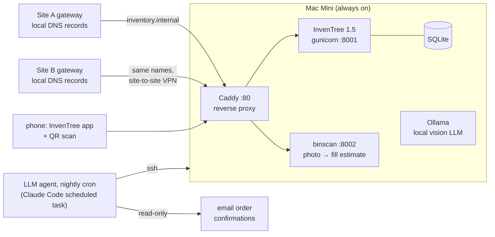

# Shop Inventory — an InvenTree build-out for a real workshop

How one person's electronics bench and machine shop went from "piles and
mystery drawers" to a searchable, self-maintaining inventory — using
[InvenTree](https://inventree.org), a Mac Mini, a label printer, and an LLM
agent doing the tedious parts overnight.

Built over one long weekend in August 2026. Roughly 780 parts, 470 locations,
and every workflow below was exercised on real parts before it was called done.

## The problem

A two-site home shop (electronics bench + CNC machine shop at one site, a
second workbench 1,400 miles away) with years of accumulated parts:

- Assortment kits ("850 pcs, 30 values") that answer no question
- Vintage salvage no purchase history knows about
- Parts bought for projects, stranded next to identical free stock
- Amazon/eBay/AliExpress/Mouser/distributor history scattered across a decade
- The recurring failure: **analysis that outruns the build**. If inventory
  upkeep is hard, it silently stops happening.

The design constraint for everything: *"if it's too hard it won't get done."*

## The stack



- **InvenTree 1.5** on the Mini, behind **Caddy** so every device uses
  `http://inventory.internal` — no ports, no IPs
- **UniFi local DNS records on both site gateways** (each site's clients
  resolve via their own gateway; the record must exist on both)
- **Avery 5167/8167 labels**, generated as print-exact SVG: each drawer gets
  its *address* and a QR of the same plain text
- **binscan** — a FastAPI mini-app: photograph a drawer, a vision model
  estimates how full it is (it never guesses *what* — the address determines
  that)
- **A nightly LLM agent** that mines order-confirmation emails into purchase
  orders, attaches product images, and backfills search keywords

## Principles that survived contact with reality

Each of these was adopted after the naive version failed:

1. **Locations are addresses, never contents.** `B3-R2C5` survives
   re-purposing; "MOSFET drawer" doesn't. The hand-written legacy label goes
   in the location *description*, where search finds it.
2. **Count devices, not packages.** Purchase records count what the vendor
   sold (a 3-pack). Stock counts usable units. `pack_quantity` does the
   conversion; price breaks stay per-pack, stock cost is per-device. The
   restatement check: total stock value must not change.
3. **Assortment kits are locations, not parts.** An "850 pcs, 30 values"
   resistor kit becomes a StockLocation with 30 Parts inside it. "Do I have a
   4.7k?" becomes answerable without unpacking anything.
4. **Footprint is part identity.** A 4x7mm and a 5x11mm electrolytic of the
   same value are different parts — with CAD integration, merging them means
   boards that arrive before the mistake does. Corollary: never assert an
   unmeasured footprint. Blank is honest; a guess is not.
5. **A count and an estimate are different claims.** A hand tally gets a
   stocktake date; "pack of 100, mostly there" is recorded `[ESTIMATE]` with
   no stamp — so a rolling bin-check can still find drawers never truly
   counted.
6. **Ordered ≠ received.** Auto-created POs sit in Placed until a human
   confirms the box physically arrived. (Learned from an order that was held
   for freight and never completed — it would have been phantom stock
   forever.)
7. **Allocation is a claim, not a place.** Parts bought for a project stay in
   normal stock; the project claims them via a Build order allocation. One
   red bin can hold an allocated sensor, one earmarked for the other site
   (via TransferOrder — which doubles as the packing list), and one free —
   with zero physical segregation.
8. **Identifiable gets a record; anonymous gets a bucket.** A stamped C&K or
   NKK switch earns its own part; a handful of unmarked salvage becomes one
   "Assorted" line. When a named part is pulled out of a bucket, the bucket
   count is decremented — or it double-counts.
9. **Anticipate vocabulary mismatch.** Six months later you remember
   "distance sensor", not "VL53L4CD" — and substring search means "ToF"
   doesn't even match "Time-of-Flight". Every part gets plain-language
   `keywords` at creation; a nightly job backfills the backlog.
10. **Decisions get delivered, not stored.** Anything needing human judgement
    goes into a decision queue; the nightly run push-notifies; any interactive
    session renders it as approve/decline checkboxes. Skipping is cheap to
    reverse; a wrong record is not.

## The workflows

### Drawer walk (getting reality into the database)
Human opens a drawer, photographs **the packaging, not the parts** (bag labels
carry batch numbers, pack counts, and truth), counts or estimates aloud; the
agent identifies, creates records, and files stock. ~20 stock items an hour,
including the archaeology. A photo of a label repeatedly beat every other
source — including the vendor's own listing.

### Order → drawer (the automated loop)
```
you order              → nothing to do
overnight              → PO auto-created from the confirmation email
                       → product image fetched for its parts
box arrives            → you say "arrived" (photo optional)
                       → PO closes, per-device-priced stock lands at a
                         drawer, staging dock, or nowhere-yet (all honest)
```
Consumer goods are filtered by category with an asymmetric rule: anything
uncertain is skipped-and-listed (one tap to flip), pharmacy/personal is
dropped without even logging the title.

### The overnight agent
A scheduled LLM session with a strict task file: journal-first (runs can die;
the journal is the only memory between runs), idempotent by vendor order
number, hard guardrails (never invent prices, never receive, never delete,
read-only on vendor sites). See [docs/TRAPS.md](docs/TRAPS.md) for the ways
this went wrong before it went right.

## Lessons & traps

The expensive ones — macOS TCC vs launchd, Micro-QR vs iPhone, MPTT race
conditions, Gmail marketing-subdomain decoys, iOS DNS negative caching —
are catalogued in **[docs/TRAPS.md](docs/TRAPS.md)**.

## Scripts

[`scripts/`](scripts/) holds the working tools, sanitized (`INVENTREE_HOST`,
`USER`, `/path/to/inventree` are placeholders). Highlights:

| Script | What |
|---|---|
| `make_labels_avery.py` | Print-exact Avery 5167/8167 drawer labels with QR |
| `link_barcodes.py` | Register each drawer's address as its scannable barcode |
| `file_stock.py` | Bulk stock filing: `"B3-R1C1=344:2"`, `--estimate` flag |
| `split_mmwave.py` | The cross-site split pattern: stocktake → split → move |
| `receive_pololu.py` | Split-receive a PO across two destinations |
| `mailbox_build.py` | Project claim: assembly Part → BOM → Build → allocation |
| `lrd_transfer.py` | TransferOrder as a standing inter-site packing list |
| `pitch_backfill.py` | Derive lead pitch from the standard radial series |
| `mptt_check.py` / `mptt_deep.py` | Tree-integrity verification |

## Roadmap

- **LLM search plugin** — no such InvenTree plugin exists yet; the framework
  supports custom endpoints, and a local Ollama can translate "that board
  that converts 3.3 to 5 volts" into real search terms. Club-sized project.
- **Voice**: "where are my toggle switches?" via home-assistant + the same
  translation layer (`/api/stock/?search=X&part_detail=true&location_detail=true`
  already returns a speakable answer in one call)
- **Real HTTPS** via a public domain + DNS-01, so browsers stop grumbling
- **Club inventory sharing** — see [docs/SHARING.md](docs/SHARING.md)

## License

MIT for the scripts. The lessons are free; they were expensive.
