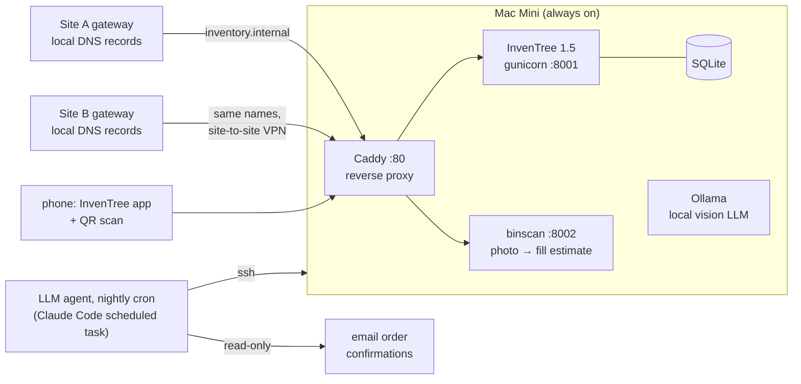

# Shop Inventory — an InvenTree build-out for a real workshop

How one person's electronics bench and machine shop went from "piles and
mystery drawers" to a searchable, self-maintaining inventory — using
[InvenTree](https://inventree.org), a Mac Mini, a label printer, and an LLM
agent doing the tedious parts overnight.

Built over one long weekend in August 2026. Roughly 780 parts, 470 locations,
and every workflow below was exercised on real parts before it was called done.

## The problem

A two-site home shop (electronics bench + CNC machine shop at one site, a
second workbench 1,400 miles away) with years of accumulated parts:

- Assortment kits ("850 pcs, 30 values") that answer no question
- Vintage salvage no purchase history knows about
- Parts bought for projects, stranded next to identical free stock
- Amazon/eBay/AliExpress/Mouser/distributor history scattered across a decade
- The recurring failure: **analysis that outruns the build**. If inventory
  upkeep is hard, it silently stops happening.

The design constraint for everything: *"if it's too hard it won't get done."*

## The stack



- **InvenTree 1.5** on the Mini, behind **Caddy** so every device uses
  `http://inventory.internal` — no ports, no IPs
- **UniFi local DNS records on both site gateways** (each site's clients
  resolve via their own gateway; the record must exist on both)
- **Avery 5167/8167 labels**, generated as print-exact SVG: each drawer gets
  its *address* and a QR of the same plain text
- **binscan** — a FastAPI mini-app: photograph a drawer, a vision model
  estimates how full it is (it never guesses *what* — the address determines
  that)
- **A nightly LLM agent** that mines order-confirmation emails into purchase
  orders, attaches product images, and backfills search keywords

## Principles that survived contact with reality

Each of these was adopted after the naive version failed:

1. **Locations are addresses, never contents.** `B3-R2C5` survives
   re-purposing; "MOSFET drawer" doesn't. The hand-written legacy label goes
   in the location *description*, where search finds it.
2. **Count devices, not packages — and price per device too.** Stock counts
   usable units. The original design used `pack_quantity` to convert and left
   price breaks per-pack; that produced pack-vs-unit errors repeatedly (a
   $19.82 3-pack valued at $19.82 *each*), because two conventions coexisting
   means every script has to know which one a given part follows. Settled
   rule: **`pack_quantity` is always 1 and the price is always per item**, with
   the pack size recorded in the notes. A vendor title claiming a pack is
   evidence, not proof — the two false-positive classes are dimensions
   ("20 x 9.5in") and assortment kits, and only a human can tell "4 identical
   holders" from "a set of 4 different things."
3. **Assortment kits are locations, not parts.** An "850 pcs, 30 values"
   resistor kit becomes a StockLocation with 30 Parts inside it. "Do I have a
   4.7k?" becomes answerable without unpacking anything.
4. **Footprint is part identity.** A 4x7mm and a 5x11mm electrolytic of the
   same value are different parts — with CAD integration, merging them means
   boards that arrive before the mistake does. Corollary: never assert an
   unmeasured footprint. Blank is honest; a guess is not.
5. **A count and an estimate are different claims.** A hand tally gets a
   stocktake date; "pack of 100, mostly there" is recorded `[ESTIMATE]` with
   no stamp — so a rolling bin-check can still find drawers never truly
   counted. Kit quantities come in three tiers, and only the first is a
   count: someone tallied it; the card states a per-value number; the number
   was divided out of a total. The lower two are both `[ESTIMATE]`, but a
   stated number is evidence and a divided one is arithmetic — record which
   it was, because a card that says "20 per value" can be checked against the
   box and `850/30 = 28` never can.
6. **Ordered ≠ received.** Auto-created POs sit in Placed until a human
   confirms the box physically arrived. (Learned from an order that was held
   for freight and never completed — it would have been phantom stock
   forever.)
7. **Allocation is a claim, not a place.** Parts bought for a project stay in
   normal stock; the project claims them via a Build order allocation. One
   red bin can hold an allocated sensor, one earmarked for the other site
   (via TransferOrder — which doubles as the packing list), and one free —
   with zero physical segregation.
8. **Identifiable gets a record; anonymous gets a bucket.** A stamped C&K or
   NKK switch earns its own part; a handful of unmarked salvage becomes one
   "Assorted" line. When a named part is pulled out of a bucket, the bucket
   count is decremented — or it double-counts. Extension for **equipment
   carrying a unique serial** — a radio, an instrument, a board with a MAC:
   set `trackable` and put the serial on the stock item, not in the notes.
   Two identical units are then distinguishable, which is the whole point;
   a MAC or FCC ID goes in the notes because it identifies the *unit* but is
   not what you would search for. First applied 2026-08-21 to a MikroTik
   Metal 2SHPn (#930). Corollary: **an item nobody can point at is not
   stock.** The PoE injector for that radio is owned and unlocated, so it is
   a sentence on the radio's record — inventing a record with no location
   would put a findable-looking thing in the database that nobody can find.
9. **Anticipate vocabulary mismatch.** Six months later you remember
   "distance sensor", not "VL53L4CD" — and substring search means "ToF"
   doesn't even match "Time-of-Flight". Every part gets plain-language
   `keywords` at creation; a nightly job backfills the backlog.
10. **Decisions get delivered, not stored.** Anything needing human judgement
    goes into a decision queue; the nightly run push-notifies; any interactive
    session renders it as approve/decline checkboxes. Skipping is cheap to
    reverse; a wrong record is not.
11. **A default location is where a *spare* goes home.** Not where a committed
    unit happens to sit — a board on the bench or fitted into a build is in
    use, not at home. Never a staging area or a bare site root: that blesses
    the backlog, making a part officially "belong" in the pile it's stuck in.
    No home yet? Leave it blank. An empty field asks a question; a wrong one
    answers it badly.
12. **Absent beats plausible.** When a spec can't be verified — the vendor
    site is behind bot detection, the order page won't open, the compartment
    hasn't been counted — record what *is* certain, link the source, and write
    down why the rest is missing. A plausible number nobody re-checks is worse
    than a gap, because the gap still asks to be filled. Corollary: never let a
    heuristic's output acquire a stocktake date. Corollary: **a count and an
    identity are separate claims and can be recorded at different
    confidence.** Five diodes were tallied (certain) while their part number
    was inherited from a kit list whose markings were illegible (not
    certain) — so the quantity got a stocktake date and the identity got a
    written caveat naming what it rested on. Hours later a cleaner unit read
    `ST / 48` and the caveat was struck. Collapsing the two into one
    "verified" would have made the gap unfindable, and refusing to record
    anything until both were sure would have lost the count.
13. **Match the part to the drawer class — a large drawer is a scarce
    resource.** Four TO-220 regulators were filed into B3-R5C2, a 59.9 cu in
    large drawer, purely because it was the nearest verified-empty one. Scott:
    *"we don't wanna waste big drawers with little parts."* Moved to A3-R6C3,
    20.8 cu in. There are far more small drawers than large ones, and a large
    one spent on four parts cannot be recovered without a second handling.
    Filter free drawers by `metadata.size.cls` before proposing one, and
    prefer the smallest class the part fits.
14. **Drawer capacity is a number, not a vibe.** Location `metadata.size`
    carries width, depth, height and cubic inches for all 324 Akro-Mils
    drawers. Three drawer recommendations were wrong in one morning because
    capacity was inferred from *line counts*, which measure records rather than
    volume: "2 lines, 5 units" was a full drawer. Query the size.

## The workflows

### Drawer walk (getting reality into the database)
Human opens a drawer, photographs **the packaging, not the parts** (bag labels
carry batch numbers, pack counts, and truth), counts or estimates aloud; the
agent identifies, creates records, and files stock. ~20 stock items an hour,
including the archaeology. A photo of a label repeatedly beat every other
source — including the vendor's own listing.

### Order → drawer (the automated loop)
```
you order              → nothing to do
overnight              → PO auto-created from the confirmation email
                       → product image fetched for its parts
box arrives            → you say "arrived" (photo optional)
                       → PO closes, per-device-priced stock lands at a
                         drawer, staging dock, or nowhere-yet (all honest)
```
Consumer goods are filtered by category with an asymmetric rule: anything
uncertain is skipped-and-listed (one tap to flip), pharmacy/personal is
dropped without even logging the title.

### The overnight agent
A scheduled LLM session with a strict task file: journal-first (runs can die;
the journal is the only memory between runs), idempotent by vendor order
number, hard guardrails (never invent prices, never receive, never delete,
read-only on vendor sites). See [docs/TRAPS.md](docs/TRAPS.md) for the ways
this went wrong before it went right.

## Lessons & traps

The expensive ones — macOS TCC vs launchd, Micro-QR vs iPhone, MPTT race
conditions, Gmail marketing-subdomain decoys, iOS DNS negative caching —
are catalogued in **[docs/TRAPS.md](docs/TRAPS.md)**.

## Scripts

[`scripts/`](scripts/) holds the working tools, sanitized (`INVENTREE_HOST`,
`USER`, `/path/to/inventree` are placeholders). Highlights:

| Script | What |
|---|---|
| **`itq`** | **The one stable command shape.** Ships a script to the server, runs it under the right venv/settings/cwd, filters startup noise. `itq run f.py`, `itq sql "…"`, `itq pull/push`. Exists so a single permission rule covers all future work — see the Agent tooling trap |
| `make_labels_avery.py` | Print-exact Avery 5167/8167 drawer labels with QR |
| `make_location_labels.py` | Location labels: QR + big name, `--skip-rows` to resume a part-used sheet, `--commit` assigns the barcode |
| `make_parent_labels.py` | Labels for the *furniture*, so a cabinet decodes its own drawers. Derives the prefix from the children (`AT-D1/D2/D3` → `AT`) rather than storing it |
| `link_barcodes.py` | Register each drawer's address as its scannable barcode |
| `file_stock.py` | Bulk stock filing: `"B3-R1C1=344:2"`, `--estimate` flag |
| `split_mmwave.py` | The cross-site split pattern: stocktake → split → move |
| `receive_pololu.py` | Split-receive a PO across two destinations |
| `mailbox_build.py` | Project claim: assembly Part → BOM → Build → allocation |
| **`florida.py`** | Earmark stock for the other site **without moving or splitting it** — metadata + tag, plus a packing list. An allocation says a part is spoken for; it doesn't get it into a box |
| `lrd_transfer.py` | TransferOrder as a standing inter-site packing list |
| **`photo_pull.py`** | Extract every photo from a chat session transcript *with its surrounding conversation* — a directory of 40 anonymous JPEGs is no better than none; the text is what says which drawer |
| **`photo_push.py`** | Attach a photo to a location and/or part. Fills a blank `Part.image` but **never overwrites** one; scene photos (several parts in one drawer) go on the location, which has no image field of its own |
| `pitch_backfill.py` | Derive lead pitch from the standard radial series |
| `mptt_check.py` / `mptt_deep.py` | Tree-integrity verification |

## Roadmap

- **LLM search plugin** — no such InvenTree plugin exists yet; the framework
  supports custom endpoints, and a local Ollama can translate "that board
  that converts 3.3 to 5 volts" into real search terms. Club-sized project.
- **Voice**: "where are my toggle switches?" via home-assistant + the same
  translation layer (`/api/stock/?search=X&part_detail=true&location_detail=true`
  already returns a speakable answer in one call)
- **Real HTTPS** via a public domain + DNS-01, so browsers stop grumbling
- **Club inventory sharing** — see [docs/SHARING.md](docs/SHARING.md)

## License

MIT for the scripts. The lessons are free; they were expensive.
